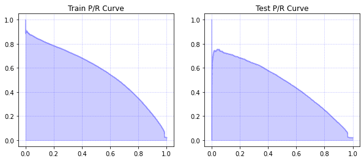

# mini-MusicNet
## A music-domain dataset for multi-label classification

Music transcription is sequence-to-sequence prediction problem: given an audio performance, we must predict a corresponding sequence of notes.
If we ignore correlations in the sequence of notes, music transcription simplifies to a multi-label classification problem.
Given an audio performance, we are tasked with predicting the set of notes present in an audio performance at a given time.
The mini-MusicNet dataset is derived from the [MusicNet](https://zenodo.org/record/5120004) dataset, providing a scaled-down, pre-processed subset of MusicNet suitable for multi-label classification.

This repository provides information for downloading and interacting with mini-MusicNet, as well as some algorithmic baselines for multi-label classification with mini-MusicNet.

## About mini-MusicNet

The mini-MusicNet dataset can be downloaded [here](https://drive.google.com/drive/folders/10Cz6As5hiFkRZKA3hrv9qBH5tn0OC3H1?usp=sharing).

This dataset consists of n = 82,500 data points with d = 4,096 features and k = 128 binary labels per datapoint. Each data point is an approximately 9ms audio clip: these clips are sampled at regular intervals from the underlying MusicNet dataset. Each clip is normalized to amplitudes in [-1,1]. The label on a datapoint is a binary k-dimensional (multi-hot) vector that indicates the notes being performed at the center of the audio clip. We define train, validation, and test splits with n = 62,500, 10,000, and 10,000 data points respectively. The mini-MusicNet dataset can be acquired [here](https://drive.google.com/drive/folders/10Cz6As5hiFkRZKA3hrv9qBH5tn0OC3H1?usp=sharing). Alternatively, you can use `construct.py` to reconstruct mini-MusicNet from a copy of [MusicNet](https://zenodo.org/record/5120004).

## Exploring mini-MusicNet

To get started, let's load and visualize the training data. The contents of this section are summarized in the ``explore.ipynb`` notebook.

    import numpy as np
    import matplotlib.pyplot as plt

    Xtrain = np.load('minimusic/audio-train.npy')
    Ytrain = np.load('minimusic/labels-train.npy')

    fig, ax = plt.subplots(1, 2, figsize=(10,2))
    ax[0].set_title('Raw acoustic features')
    ax[0].plot(Xtrain[0])
    ax[1].set_title('Fourier transform of the raw features')
    ax[1].plot(np.abs(np.fft.rfft(Xtrain[0])[0:256])) # clip to 256 features for easier visualization



Now let's see how linear (ridge) regression performs on the raw audio features. We'll measure results using [average precision](https://scikit-learn.org/stable/modules/generated/sklearn.metrics.average_precision_score.html). 

    from sklearn.metrics import average_precision_score

    Xtest = np.load('minimusic/audio-test.npy')
    Ytest = np.load('minimusic/labels-test.npy')

    R = .001
    beta = np.dot(np.linalg.inv(np.dot(Xtrain.T,Xtrain) + R*np.eye(Xtrain.shape[1])),np.dot(Xtrain.T,Ytrain))

    print('Train AP:', round(average_precision_score(Ytrain, np.dot(Xtrain, beta), average='micro'), 2))
    print('Test AP:', round(average_precision_score(Ytest, np.dot(Xtest, beta), average='micro'), 2))

Results:

    Train AP: 0.19
    Test AP: 0.04

That's not so great. We can do much better by transforming our audio wave to the [Fourier](https://en.wikipedia.org/wiki/Fourier_transform) domain.

    Xtrainfft = np.abs(np.fft.rfft(Xtrain))
    Xtestfft = np.abs(np.fft.rfft(Xtest))

    R = .001
    beta = np.dot(np.linalg.inv(np.dot(Xtrainfft.T,Xtrainfft) + R*np.eye(Xtrainfft.shape[1])),np.dot(Xtrainfft.T,Ytrain))

    print('Train AP:', round(average_precision_score(Ytrain, np.dot(Xtrainfft, beta), average='micro'), 2))
    print('Test AP:', round(average_precision_score(Ytest, np.dot(Xtestfft, beta), average='micro'), 2))

Results:

    Train AP: 0.57
    Test AP: 0.47

Finally, it can often be more revealing to look at a precision-recall curve, rather than the scalar average precision (the area under the P/R curve). Let's see what our full P/R curve looks like for ridge regression on Fourier features.

    fig, ax = plt.subplots(1, 2, figsize=(10,4))
    ax[0].set_title('Train P/R Curve')
    plot_pr_curve(ax[0], Ytrain, np.dot(Xtrainfft, beta))
    ax[1].set_title('Test P/R Curve')
    plot_pr_curve(ax[1], Ytest, np.dot(Xtestfft, beta))


And that's enough to get us started! We hope that mini-MusicNet can be a useful resource for empirical work in multi-label classification.


## References

For further information about MusicNet, or if you want to cite this work, please see:

```bib
@inproceedings{thickstun2017learning,
  author    = {John Thickstun and Zaid Harchaoui and Sham M. Kakade},
  title     = {Learning Features of Music from Scratch},
  booktitle = {International Conference on Learning Representations},
  year      = {2017},
}
```

